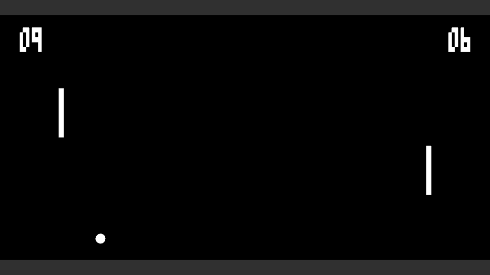

# Pong

A simple Pong game made with [gameskel](https://github.com/jube/gameskel).

## Requirements

Pong is written in C++11 so you need a C++11 compiler like [Clang](http://clang.llvm.org/) or [GCC](http://gcc.gnu.org/).

Pong also needs external libraries:

* [SFML2](http://www.sfml-dev.org/)
* [Boost.Filesystem](http://www.boost.org/libs/filesystem/)

## Build and install

You can download the sources directly from github:

    git clone https://github.com/jube/pong.git

Then you have to use [CMake](http://www.cmake.org/) to build the project:

    cd pong
    mkdir build
    cd build
    cmake ..
    make

Finally, you can install the files (you may need root permissions):

    make install

## Play

Left player:

- `S` for up
- `X` for down

Right player:

- `Up` for up
- `Down` for down

Misc:

- `Esc` for stopping the game
- `F` for toggling fullscreen

## Authors

- Julien Bernard, julien dot bernard at univ dash fcomte dot fr

## Copyright

This library is open source and is distributed under the [MIT license](http://opensource.org/licenses/MIT).

